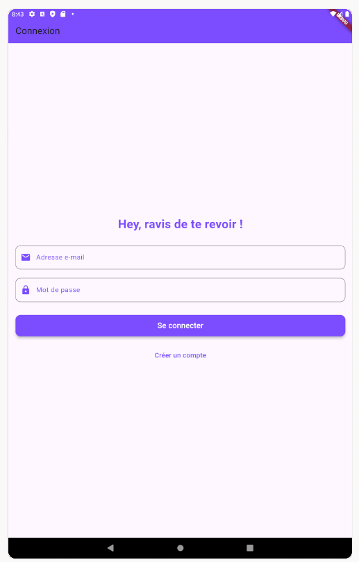
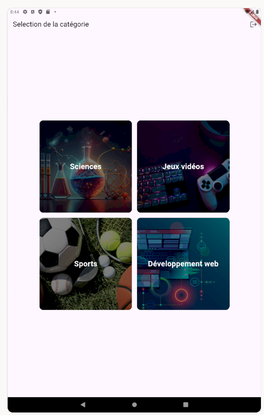
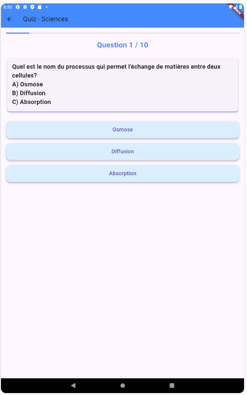

<p align="center">  
 
 
</p>

## Description

BuzzIt est une application mobile développée avec **Flutter** et utilisant des concepts de **Material Design** pour une interface moderne et réactive. 
Cette application permet aux utilisateurs de **s'inscrire** et de **se connecter** via Firebase, avec des fonctionnalités supplémentaires telles que la gestion de catégories et la participation à des quiz interactifs.

### Fonctionnalités principales :
- **Connexion / Inscription avec Firebase** : Les utilisateurs peuvent créer un compte et se connecter avec leur email et mot de passe.
- **Choix de catégorie** : Sélectionner une catégorie de quiz pour démarrer une nouvelle session de questions.
- **Interaction une IA** : Génération de quiz à partir d'une API externe (IA GROQ), proposant des questions en fonction de la catégorie choisie.
- **Interface utilisateur responsive** : Interface moderne et intuitive, basée sur le framework **Material Design**.

## Prérequis

Avant de pouvoir lancer l'application, assurez-vous que vous avez les éléments suivants installés :
- [Flutter](https://flutter.dev/docs/get-started/install)
- [Android Studio](https://developer.android.com/studio) ou [VS Code](https://code.visualstudio.com/) avec les extensions Flutter et Dart installées.
- Un projet Firebase pour l'authentification des utilisateurs.

## Installation

1. **Clonez le projet** :
   ```bash
   git clone https://github.com/mardev60/buzzit-quiz/
   cd buzzit-quiz

## Captures d'écran
<p align="center">  
  
  <br/>
  
  <br/>
  
</p>
